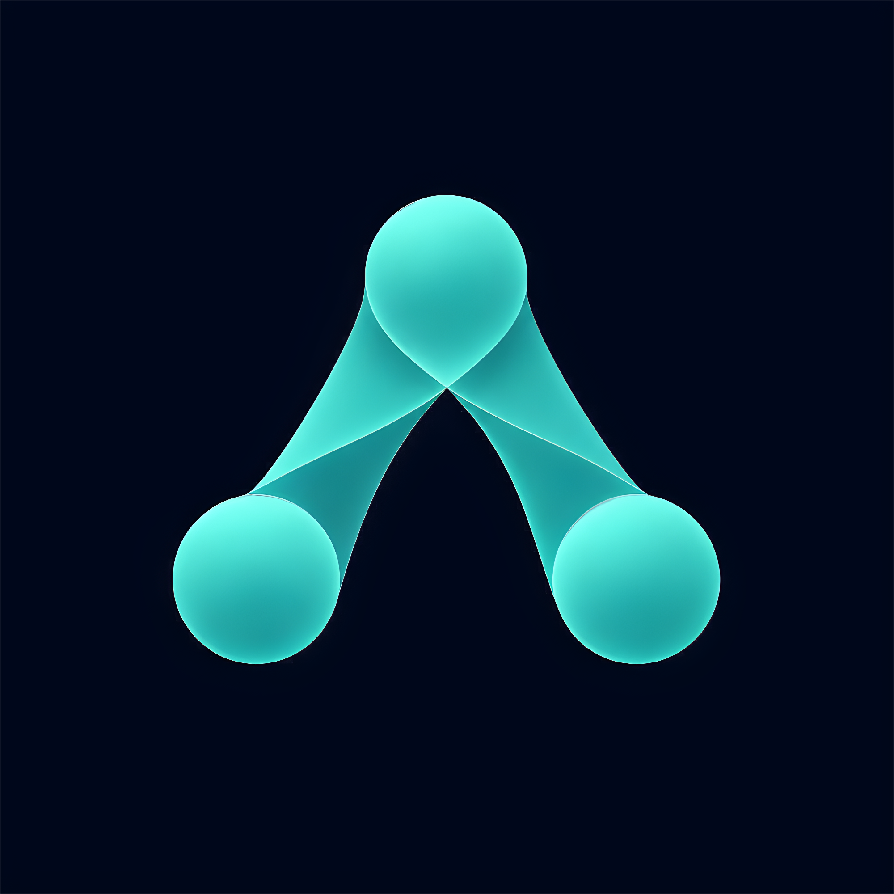

<div align="center">



<br>
<br>

```

  ███╗   ███╗ ███████╗ ██████╗  ██████╗  ██╗  █████╗  ███╗   ██╗
  ████╗ ████║ ██╔════╝ ██╔══██╗ ██╔══██╗ ██║ ██╔══██╗ ████╗  ██║
  ██╔████╔██║ █████╗   ██████╔╝ ██████╔╝ ██║ ███████║ ██╔██╗ ██║
  ██║╚██╔╝██║ ██╔══╝   ██╔══██╗ ██╔══██╗ ██║ ██╔══██║ ██║╚██╗██║
  ██║ ╚═╝ ██║ ███████╗ ██████╔╝ ██████╔╝ ██║ ██║  ██║ ██║ ╚████║
  ╚═╝     ╚═╝ ╚══════╝ ╚═════╝  ╚═════╝  ╚═╝ ╚═╝  ╚═╝ ╚═╝  ╚═══╝

        T H E   O P E R A T I N G   L A Y E R
              F O R   A I   E M P L O Y E E S .

```

<br>

<p>
<a href="mailto:contact@mebbian.ai"></a>
&nbsp;

&nbsp;

</p>

<br>

Mebbian gives AI employees the context they need<br>
to work inside a business.

<br>

---

</div>

<br>

##  &nbsp; About

Mebbian is building the operating layer beneath AI employees.

It remembers what a company knows, preserves how decisions are made, and gives agents a reliable runtime for taking action inside a business.

<br>

<div align="center">
<table>
<tr>
<td align="center" width="33%">
<br>

<br><br>
<b>Memory Layer</b>
<br><br>
<sub>What the business knows. Facts, context, entities, workflows, exceptions, and customer-specific operating knowledge.</sub>
<br><br>
</td>
<td align="center" width="33%">
<br>

<br><br>
<b>Decision Layer</b>
<br><br>
<sub>How the business thinks. Rationale, tradeoffs, approvals, escalation patterns, and decision traces.</sub>
<br><br>
</td>
<td align="center" width="33%">
<br>

<br><br>
<b>Runtime Layer</b>
<br><br>
<sub>How AI employees operate. Tools, permissions, state, coordination, escalation, and human approval flows.</sub>
<br><br>
</td>
</tr>
</table>
</div>

<br>

##  &nbsp; Product Wedge

The first product captures and qualifies after-hours leads, then alerts the right person only when something matters, with context and decision reasoning attached.

The first product is the proof point for the infrastructure underneath.

<br>

##  &nbsp; Engineering Principles

<table>
<tr>
<td>

&nbsp;&nbsp;&nbsp;&nbsp; &nbsp; **Context compounds** &nbsp;&nbsp;-&nbsp;&nbsp; Every approved fact should make the next agent run better

&nbsp;&nbsp;&nbsp;&nbsp; &nbsp; **Writes are traceable** &nbsp;&nbsp;-&nbsp;&nbsp; Every meaningful change needs provenance

&nbsp;&nbsp;&nbsp;&nbsp; &nbsp; **Decisions are explainable** &nbsp;&nbsp;-&nbsp;&nbsp; Agents should carry reasoning, not just outputs

&nbsp;&nbsp;&nbsp;&nbsp; &nbsp; **Escalation is a feature** &nbsp;&nbsp;-&nbsp;&nbsp; Agents should know when a human must approve the next step

&nbsp;&nbsp;&nbsp;&nbsp; &nbsp; **Canonical memory is earned** &nbsp;&nbsp;-&nbsp;&nbsp; Nothing becomes canonical until it is approved

</td>
</tr>
</table>

<br>

##  &nbsp; Repositories

Core repositories are private while the product is under active development.

<br>

<table>
<tr>
<td width="50%">

**`mebbian-platform`**  
Product application layer, user surfaces, APIs, and workflows.

**`mebbian-context-graph`**  
Memory, context, and decision graph systems.

**`mebbian-agent-runtime`**  
Agent execution, state, permissions, escalation, and coordination.

</td>
<td width="50%">

**`mebbian-mcp`**  
MCP and tool interface layer for AI employees.

**`mebbian-infra`**  
Deployment, environments, CI, monitoring, and operational scripts.

**`mebbian-docs`**  
Internal architecture, product, and operating documents.

</td>
</tr>
</table>

<br>

##  &nbsp; Access

Mebbian is private-by-default during active development.

Public surfaces should describe what the system does. Internal repositories contain implementation, operating context, and product architecture.

<br>

<div align="center">

<a href="mailto:contact@mebbian.ai"></a>

<br>
<br>

---

<br>

<sub>Mebbian &middot; 2026</sub>

<br>
<br>

</div>
